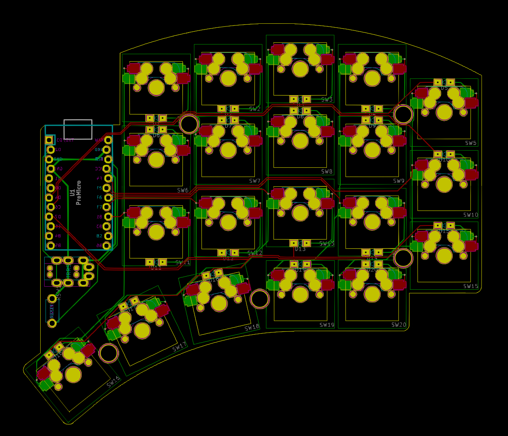

# Puggle Keyboard

The Puggle is 5×3+5 keys column-staggered split keyboard based on the [Sofle](https://github.com/josefadamcik/SofleKeyboard) and [Torn](https://github.com/rtitmuss/torn) keyboards. It is currently in development.

- [Keyboard Layout Editor](http://www.keyboard-layout-editor.com/##@_backcolor=%23ffffff&name=Puggle&author=jimmerricks%3B&@_x:2%3B&=E&_x:7%3B&=I%3B&@_y:-0.875&x:1%3B&=W&_x:1%3B&=R&_x:5%3B&=U&_x:1%3B&=O%3B&@_y:-0.875&x:4%3B&=T&_x:3%3B&=Y%3B&@_y:-0.625%3B&=Q&_x:11%3B&=P%3B&@_y:-0.625&x:2%3B&=D&_x:7%3B&=K%3B&@_y:-0.875&x:1%3B&=S&_x:1&n:true%3B&=F&_x:5&n:true%3B&=J&_x:1%3B&=L%3B&@_y:-0.875&x:4%3B&=G&_x:3%3B&=H%3B&@_y:-0.625%3B&=A&_x:11%3B&=%2F:%0A%2F%3B%3B&@_y:-0.625&x:2%3B&=C&_x:7%3B&=%3C%0A,%3B&@_y:-0.875&x:1%3B&=X&_x:1%3B&=V&_x:5%3B&=M&_x:1%3B&=%3E%0A.%3B&@_y:-0.875&x:4%3B&=B&_x:3%3B&=N%3B&@_y:-0.625%3B&=Z&_x:11%3B&=%3F%0A%2F%2F%3B&@_y:-0.5&x:1&a:7%3B&=PgUp%0A%0A%0A%0ALGui&=PgDn%0A%0A%0A%0ALAlt&_x:7%3B&=STab%0A%0A%0A%0ALAlt&=Tab%0A%0A%0A%0ARGui%3B&@_r:13&rx:2.5&ry:8.625&y:-5.5&x:-0.5%3B&=Esc%0A%0A%0A%0ALCtl%3B&@_r:26&y:-1&x:-0.5%3B&=BSpc%3B&@_r:39&y:-1&x:-0.5%3B&=LSft%3B&@_r:-39&rx:10.5&y:-5.5&x:-0.5%3B&=RSft%3B&@_r:-26&y:-1&x:-0.5%3B&=Spc%0A%0A%0A%0AMoves%3B&@_r:-13&y:-1&x:-0.5%3B&=Ent%0A%0A%0A%0ARCtl)
